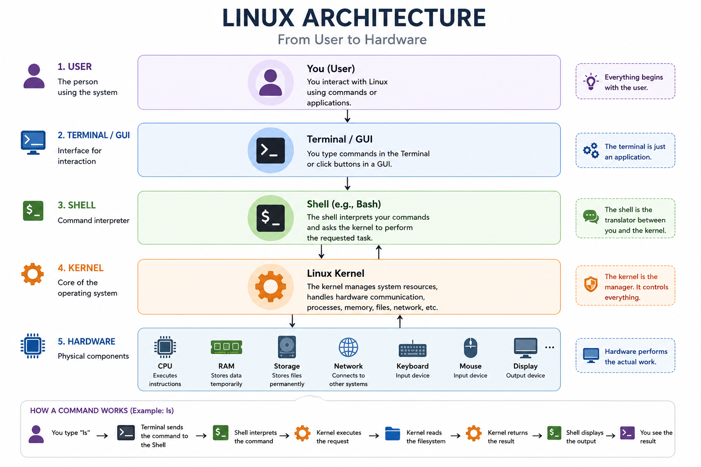

# 🏗️ Linux Architecture

> *"Understanding Linux Architecture helps you understand what happens behind the scenes every time you type a Linux command."*

---

# 📌 Why Learn Linux Architecture?

When you type a command like:

```bash
ls
```

it looks simple.

But behind the scenes, several components work together before the output appears on your screen.

Understanding these components will make learning Linux much easier throughout this course.

---

# 🖼️ Linux Architecture

<p align="center">
  
</p>

The diagram above shows the complete journey of every command—from **you**, all the way down to the **hardware**.

Let's understand each layer.

---

# 👤 Layer 1 — User

Everything starts with **you**.

You interact with Linux by:

* Typing commands
* Opening applications
* Clicking buttons
* Reading files
* Running programs

Without a user, the operating system has nothing to execute.

---

# 💻 Layer 2 — Terminal

The **Terminal** is simply an application.

It provides a place where you can type Linux commands.

Examples include:

* GNOME Terminal
* macOS Terminal
* Windows Terminal
* Konsole
* Alacritty

The Terminal **does not understand Linux commands**.

Its only job is to send your input to the Shell.

Think of it as a microphone.

It listens to you.

It doesn't make decisions.

---

# 🐚 Layer 3 — Shell

The Shell is the **command interpreter**.

Whenever you type a command, the Shell reads it and determines what you want to do.

Example:

```bash
pwd
```

The Shell understands that you want to display your current working directory.

It then requests the Kernel to perform that operation.

Some popular shells include:

* Bash
* Zsh
* Fish
* Dash

Throughout this course, we'll use **Bash**.

---

# ❤️ Layer 4 — Kernel

The Kernel is the **heart of Linux**.

It is the first component loaded when Linux starts.

The Kernel communicates directly with the hardware.

Whenever a program needs to:

* Read a file
* Write a file
* Allocate memory
* Connect to the internet
* Execute a process
* Access storage

it requests the Kernel.

The Kernel decides:

* Is this request allowed?
* Which hardware should be used?
* How should it be executed?

You can think of the Kernel as the **manager** of the operating system.

---

# 🖥️ Layer 5 — Hardware

Hardware refers to the physical components of your computer.

Examples include:

* CPU
* RAM
* SSD / HDD
* Keyboard
* Mouse
* Monitor
* Speakers
* Network Card

Hardware does **not** understand Linux commands.

It only understands machine instructions.

The Kernel converts high-level requests into instructions the hardware can execute.

---

# 🔍 Behind the Scenes

Suppose you execute:

```bash
ls
```

The following sequence takes place:

### Step 1

You type:

```bash
ls
```

and press **Enter**.

↓

### Step 2

The Terminal sends the command to the Shell.

↓

### Step 3

The Shell recognizes the command.

↓

### Step 4

The Shell asks the Kernel to execute it.

↓

### Step 5

The Kernel reads the current directory from the filesystem.

↓

### Step 6

The Kernel returns the results.

↓

### Step 7

The Shell prints the output inside the Terminal.

All of this happens in just a few milliseconds.

---

# 🎯 One Important Rule

Applications never directly communicate with the hardware.

Instead, they always follow this path:

```text
Application
      │
      ▼
    Kernel
      │
      ▼
   Hardware
```

This design makes Linux:

* Stable
* Secure
* Reliable
* Efficient

---

# 🛡️ Why This Matters in Cyber Security

Understanding Linux Architecture helps you understand:

* How processes are created
* How files are accessed
* Why permissions exist
* How malware interacts with the operating system
* How system calls work
* Why privilege escalation attacks target the Kernel

Almost every advanced Cyber Security topic eventually involves the Linux Kernel.

---

# 💻 Try It Yourself

Run the following commands:

```bash
pwd
```

```bash
ls
```

```bash
echo "Hello Linux!"
```

Now ask yourself:

* Which component understood the command?
* Did the CPU understand the word `pwd`?
* What role did the Shell play?
* Which component actually interacted with the hardware?

Don't worry if you can't answer every question yet.

As we continue through the course, each chapter will reveal another piece of the puzzle.

---

# 🧠 Remember This

Whenever you execute any Linux command, remember this flow:

```text
You
   │
   ▼
Terminal
   │
   ▼
Shell
   │
   ▼
Kernel
   │
   ▼
Hardware
```

If you remember this one diagram, you'll understand almost every topic we'll study later.

---

# 📝 Check Your Understanding

Before moving on, answer these questions:

1. What is the purpose of the Terminal?
2. What is the role of the Shell?
3. What is the Kernel responsible for?
4. Can applications communicate directly with hardware?
5. What happens after you press **Enter** in the terminal?

If you can confidently answer these questions, you've built the mental model required for the rest of this Linux course.

---

# 🚀 What's Next?

Now that you understand how Linux is structured internally, it's time to explore the **Linux Filesystem**—the place where everything in Linux lives.

You'll learn:

* The Linux directory structure
* Why everything is treated as a file
* Important system directories
* Navigating the filesystem
* Your first Linux commands

Let's begin exploring Linux! 🐧
